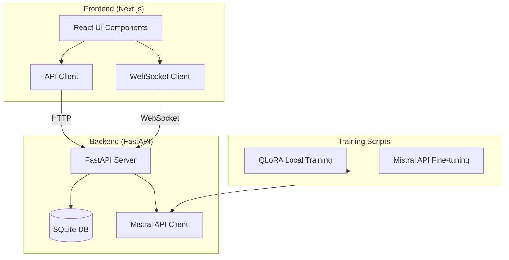

# MistralTune

[](https://github.com/Farx1/mistraltune/actions/workflows/ci.yml)
[](https://www.python.org/downloads/)
[](LICENSE)

A professional fine-tuning platform for Mistral AI models with support for both cloud-based API fine-tuning and local QLoRA training. Features a modern web dashboard for managing jobs, datasets, and comparing models.

---

## 🚀 Overview

MistralTune is a complete fine-tuning solution that demonstrates:

- **Cloud-based fine-tuning** via Mistral AI's managed API (no GPU required)
- **Local QLoRA fine-tuning** for full control and privacy (requires GPU)
- **Professional web dashboard** built with Next.js for managing the entire fine-tuning workflow
- **Real-time monitoring** with WebSocket support for job tracking
- **Model comparison tools** to evaluate fine-tuned models against base models

Built to showcase expertise in LLM fine-tuning, MLOps, and full-stack development.

---

## 🧰 Tech Stack

- **Languages**: Python 3.10+, TypeScript
- **Frameworks**: FastAPI, Next.js 15, React 19
- **AI / ML**: PyTorch, Transformers, PEFT (QLoRA), Mistral AI SDK
- **Data / Storage**: SQLite, JSONL datasets
- **Tools**: Uvicorn, WebSockets, shadcn/ui, Tailwind CSS, Framer Motion

---

## ✨ Features

- **Dual Fine-tuning Approaches**
  - Mistral API fine-tuning: Upload datasets, create jobs, monitor progress via API
  - QLoRA local training: Full control with LoRA adapters, supports custom configurations

- **Web Dashboard**
  - Upload and validate JSONL datasets
  - Create and monitor fine-tuning jobs in real-time
  - Playground for testing model inference
  - Side-by-side model comparison with metrics

- **Real-time Monitoring**
  - WebSocket connections for live job status updates
  - Progress tracking and error reporting
  - Historical job and dataset management

- **Developer Experience**
  - One-command startup (cross-platform)
  - Comprehensive API documentation (Swagger/ReDoc)
  - Automated health checks and service validation

---

## 🧠 How it works (high-level)



**Frontend**: Built with Next.js 15 and React, handles all UI interactions, dataset uploads, job creation, and real-time monitoring via WebSocket connections.

**Backend**: FastAPI server provides REST endpoints for datasets, jobs, and inference. Integrates with Mistral AI API for cloud fine-tuning and manages local SQLite database for job history.

**Training**: Supports two paths - cloud-based via Mistral API (managed infrastructure) or local QLoRA training (requires GPU, full control).

---

## 📦 Project Structure

```
mistraltune/
├── src/
│   ├── api/              # FastAPI backend
│   │   └── main.py       # API endpoints and WebSocket handlers
│   ├── mistral_api_*.py  # Mistral API integration scripts
│   ├── train_qlora.py    # Local QLoRA training
│   └── utils/            # Data I/O, metrics, utilities
├── frontend/             # Next.js application
│   ├── app/              # Pages and routes
│   ├── components/       # React components
│   └── lib/              # API client and utilities
├── configs/              # YAML configuration files
├── data/                 # Datasets (JSONL format)
├── tests/                # Test suite
└── docs/                 # Documentation
```

---

## 🧪 Getting Started

### Prerequisites

- **Python**: 3.10 or higher
- **Node.js**: 18 or higher
- **Mistral API Key**: Get one from [console.mistral.ai](https://console.mistral.ai)
- **GPU** (optional): Required only for local QLoRA training (24-48 GB VRAM recommended)

### 1. Clone the repository

```bash
git clone https://github.com/Farx1/mistraltune.git
cd mistraltune
```

### 2. Configure environment variables

Copy the example environment file:

```bash
# Linux/Mac
cp .env.example .env

# Windows
copy .env.example .env
```

Edit `.env` and set your Mistral API key:

```env
MISTRAL_API_KEY=your-mistral-api-key-here
```

Optional: Configure ports if needed:
```env
BACKEND_PORT=8000
NEXT_PUBLIC_API_URL=http://localhost:8000
NEXT_PUBLIC_WS_URL=ws://localhost:8000
```

### 3. Run the project

**Linux/Mac:**
```bash
./start.sh
```

**Windows (PowerShell):**
```powershell
.\start.ps1
```

The script will:
- Create Python virtual environment (if needed)
- Install all dependencies
- Start backend API server (port 8000)
- Start frontend dev server (port 3000)
- Display service URLs

### 4. Access the application

- **Frontend Dashboard**: http://localhost:3000
- **Backend API Docs**: http://localhost:8000/docs
- **API Health Check**: http://localhost:8000/api/health

Press `Ctrl+C` to stop all services.

---

## 📚 Usage Examples

### Via Web Dashboard

1. **Upload Dataset**: Navigate to Datasets page, upload a JSONL file
2. **Create Job**: Go to Jobs → New Job, select dataset and configure training parameters
3. **Monitor**: View real-time progress on the job detail page
4. **Test**: Use the Playground to test model inference
5. **Compare**: Use Comparison page to compare base vs fine-tuned models

### Via Command Line

#### Mistral API Fine-tuning

```bash
# Activate virtual environment
source .venv/bin/activate  # Windows: .venv\Scripts\activate

# Upload dataset and create job
python src/mistral_api_finetune.py \
    --train_file data/train.jsonl \
    --val_file data/val.jsonl \
    --model open-mistral-7b \
    --learning_rate 1e-4 \
    --epochs 3 \
    --suffix domain-qa
```

#### Local QLoRA Training

```bash
python src/train_qlora.py \
    --config configs/base.yaml \
    --lora configs/lora_r16a32.yaml
```

#### Model Comparison

```bash
python src/mistral_api_inference.py \
    --base_model open-mistral-7b \
    --fine_tuned_model ft:open-mistral-7b:XXX:20240430:XXX \
    --prompts "What is the PTO?" "Define KPI in one sentence."
```

---

## 📝 Dataset Format

Datasets must be in JSONL format with the following structure:

```json
{"instruction": "What is the PTO?", "input": "", "output": "PTO stands for Paid Time Off..."}
{"instruction": "Define KPI in one sentence.", "input": "", "output": "A KPI is a measurable indicator..."}
```

Required fields:
- `instruction` (required): The question or instruction
- `output` (required): The expected response
- `input` (optional): Additional context

---

## 🧪 Testing

### Running Tests

The test suite uses **DEMO_MODE** by default, which mocks the Mistral API to avoid real API calls and costs. This allows tests to run quickly without requiring API keys.

```bash
# Activate virtual environment first
source .venv/bin/activate  # Windows: .venv\Scripts\activate

# Run all tests (uses DEMO_MODE=1 by default)
pytest tests/ -v

# Run specific test file
pytest tests/test_api_health.py -v

# Run tests with real API (requires MISTRAL_API_KEY)
DEMO_MODE=0 pytest tests/ -v
```

### Test Coverage

The test suite includes:
- **API Endpoints**: Health checks, dataset upload, job creation, inference
- **WebSocket**: Real-time job monitoring
- **Validation**: JSONL file validation
- **Data I/O**: Dataset loading and formatting
- **Smoke Tests**: Tokenization and basic functionality

All tests are designed to run without GPU and without downloading large models.

### Fresh Clone Test

To verify that the project can be set up from a fresh clone:

**Windows (PowerShell):**
```powershell
.\scripts\fresh_clone_check.ps1
```

**Linux/Mac:**
```bash
chmod +x scripts/fresh_clone_check.sh
./scripts/fresh_clone_check.sh
```

This script:
1. Cleans all build artifacts
2. Creates a fresh virtual environment
3. Installs all dependencies
4. Runs the test suite
5. Builds the frontend
6. Tests the API health endpoint

If all steps pass, the project is ready for deployment.

### Continuous Integration

This project uses GitHub Actions for CI/CD. The CI pipeline runs on every push and pull request:

- **Backend**: Linting (Ruff), formatting checks (Black, Ruff format), and pytest tests
- **Frontend**: ESLint and production build
- **Test Verification**: Ensures at least 5 tests are discovered and run

All tests run in **DEMO_MODE** (no real API calls) to keep CI fast and cost-free.

View CI status: [](https://github.com/Farx1/mistraltune/actions/workflows/ci.yml)

---

## 🔧 Development

### Backend Development

```bash
# Activate virtual environment
source .venv/bin/activate

# Run backend only
cd src/api
python main.py

# Or with uvicorn
uvicorn api.main:app --reload --host 0.0.0.0 --port 8000
```

### Frontend Development

```bash
cd frontend
npm run dev
```

### Code Quality

```bash
# Backend linting
ruff check src/ tests/

# Backend formatting
black src/ tests/

# Frontend linting
cd frontend
npm run lint

# Frontend build check
cd frontend
npm run build
```

---

## 🐛 Troubleshooting

### Port Already in Use

If you see "Port XXXX is already in use":
- Stop any existing services on ports 8000 or 3000
- Or change ports in `.env` file

### MISTRAL_API_KEY Error

If backend shows API key errors:
- Ensure `.env` file exists in project root
- Verify `MISTRAL_API_KEY` is set correctly
- Restart backend after changing `.env`

### Frontend Can't Connect to Backend

- Verify backend is running: `curl http://localhost:8000/api/health`
- Check `NEXT_PUBLIC_API_URL` in `.env` matches backend URL
- Check browser console for CORS errors (backend should allow all origins in dev)

### Windows PowerShell Execution Policy

If you get execution policy errors on Windows:
```powershell
Set-ExecutionPolicy -ExecutionPolicy RemoteSigned -Scope CurrentUser
```

### Virtual Environment Issues

If dependencies aren't found:
```bash
# Recreate virtual environment
rm -rf .venv  # Windows: rmdir /s .venv
python -m venv .venv
source .venv/bin/activate  # Windows: .venv\Scripts\activate
pip install -r requirements.txt
```

---

## 📚 What I learned

- **LLM Fine-tuning**: Deep understanding of QLoRA, LoRA adapters, and API-based fine-tuning workflows
- **Full-stack Integration**: Building seamless connections between React frontend, FastAPI backend, and external APIs
- **Real-time Systems**: Implementing WebSocket-based monitoring for long-running ML jobs
- **MLOps Practices**: Structuring reproducible ML projects with proper configuration, testing, and CI/CD
- **Developer Experience**: Creating one-command startup scripts and comprehensive documentation

---

## 🔮 Possible improvements

- **Multi-user Support**: Add authentication and user management for team collaboration
- **Advanced Monitoring**: Integrate Prometheus/Grafana for detailed metrics and alerting
- **Model Versioning**: Track model versions and enable rollback capabilities
- **Distributed Training**: Support for multi-GPU and distributed QLoRA training
- **Cost Optimization**: Add cost tracking and optimization suggestions for API usage
- **Export/Import**: Allow exporting fine-tuned models and importing from other platforms
- **Advanced Evaluation**: Add more metrics (BLEU, ROUGE) and automated evaluation pipelines

---

## 👤 About me (Jules)

I'm **Jules**, a M2 **Data & AI Engineering** student at **ESILV (Paris, France)**,  
with a focus on **LLMs, agentic AI, privacy-preserving ML, and quantum computing**.

- 🌐 Portfolio: https://julesbarth-myportfolio.fr  
- 💼 LinkedIn: https://www.linkedin.com/in/jules-barth  
- 📧 Email: julesbarth13@gmail.com  

Feel free to reach out if this project resonates with what you're building. 🚀

---

## 📄 License

MIT License - See [LICENSE](LICENSE) for details.

---

## 🙏 Acknowledgments

- Mistral AI for the API and models
- The open-source community for the amazing tools used in this project
